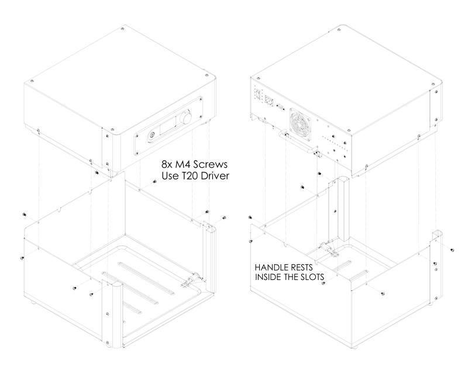
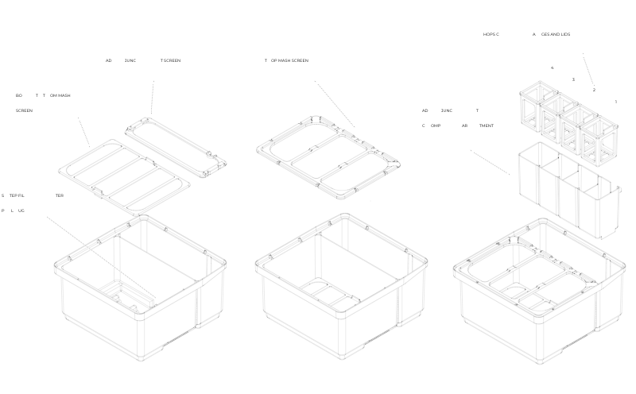
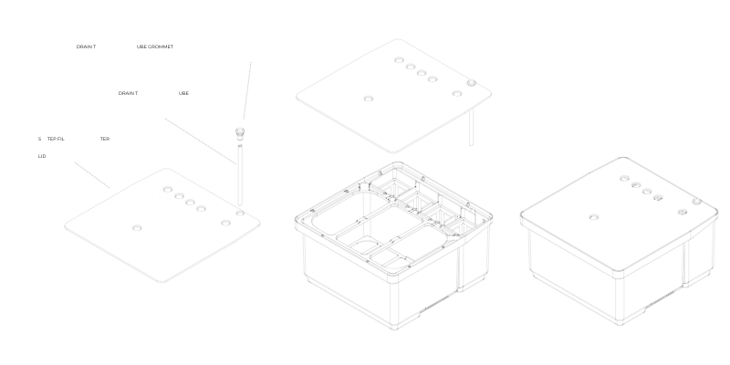

# PicoBrew Z Series
- [Safety Information](#safety)
- [What's in the Box](#inthebox)
- [Assembly](#assembly)
- [Connecting to a Network](#connecting)
- [First Rinse](#firstrinse)
- [Let's Brew](#letsbrew)
- [Care and Maintenance](#care)
- [Customer Care](#help)

# Important Safety Information {#safety}
- Exercise common sense while operating the Z.
- Always use the keg cozy to shield the hot metal of the keg.
- Close supervision is needed when used around children.
- Allow Z machine to fully cool before removing or replacing parts.
- Do not operate with a frayed cord or broken plug.
- Do not remove Step Filter from the Z unless in pause mode or brew cycle is completed.
- The Step Filter and contents may be hot when removing from the Z machine.
- Do not immerse or soak the Z machine.
- Make sure all hoses are connected before starting a brewing, rinsing or cleaning cycle.
- To avoid risk of electrical shock hazard do not disassemble the Z. There are no user serviceable 
- parts inside.
- Various surfaces can get extremely hot during the brewing cycle, use caution when handling the 
- keg, hoses and components.
- Do not remove the hose clamps, hot liquid spray may result.
- Do not remove the keg attachments while brewing.
- Use only the recommended cleaning agents for your Z. Do not use PBW, StarSan, OneStep, 
- OxyClean, or similar products. Do not soak the step filter in these products, which may lead to cracking.
- Do not seal the keg with the metal lid while running a brewing session, cleaning cycle, or rinse 
- cycle.
- Do not make any modifications to your Z or any of its components. Doing so can be dangerous, 
- will void your warranty, and may cause damage to your Z or affect its performance.
- Avoid exposing your Z to rain, moisture, or other liquids which may cause damage to your 
- machine or injury to you.
- Do not store your Z where it will be exposed to below freezing temperatures as this may 
- damage internal components.
- Only operate your Z on completely level and sturdy surfaces.
- The Z on-screen instructions represent the most up-to-date and accurate version of all Z 
- processes.  In the event of any discrepancy between this manual and the on-screen 
- instructions, always follow the on-screen instructions.

# WHAT'S IN THE BOX {#inthebox}

### BOX #1 
- Z Heating Module

### BOX #2 
- Module components
- Z Brewing Ingredients Module
- Assembly Screws (4 Black, 2 Stainless)
- T20 Screw Driver
- Drip Mat
- Heating Module Power Cord
- Step Filter components
- Step Filter
- Step Filter Keyhole Plug (3)
- Step Filter Lid
- Drain Tube
- Drain Tube Grommet (2)
- Adjunct Insert
- Top Mash Screen
- Bottom Mash Screen 
- Adjunct Screen
- Hop Cages and Lids (4 each)
- Accessories
- Keg Cozy
- Keg Seal
- Keg Seal Plug
- Foam Trap 
- Syringe
- Ball Lock Racking Hose Assembly
- Bottle of Anti-Foam
- Fast Fermentation Adapter 
- Cleaning Tubes (2)
- Dishwasher Tablet
- Dip Tube Cleaning Brush

### BOX #3 (KEG)
- Brew Keg (5 gallon)
- Metal Keg Lid

# ASSEMBLY {#assembly}

## Attaching Heating Module to Brewing Ingredients Module
Note: do not tighten the screws attaching the Heating Module to the Brewing Module until all screws have been inserted and aligned. 

## Assembling the Step Filter
> Note: one edge of the Top Mash Screen contains a groove that fits, facing downward, onto the step filter interior divider.

> Note: the order of the Hop Cages is reversed from that of the Zymatic.
Additional Equipment Recommended for the Z

Most accessories for the Z are available through our webstore, at your local homebrew shop or online homebrew retailer, or from your standard supermarket, big box store, or large online retailers such as Amazon.

- A handheld specific gravity refractometer with ATC (for measuring OG) Triple scale hydrometer, hydrometer test jar, and a glass or stainless steel wine thief or a new turkey baster. (For taking samples and measuring FG)
- A homebrew draft system or kegerator package which includes a CO2 tank, CO2 regulator, and serving and gas lines with ball lock fittings. (For carbonating and serving)
- A digital scale with a range of up to 40 lbs (For measuring grain and water)
- A small digital scale that reads in .01 oz. increments (For measuring hops and other additions)
- A homebrew specific alkaline cleanser such as Powdered Brewery Wash (PBW) for cleaning kegs (Do not use for cleaning cycles or plastic components)
- A homebrew specific sanitizer such as StarSan. (Never use bleach!)
- Food grade Gypsum and Calcium Chloride, and Irish Moss or Whirlfloc Tablets
- A 15 mm wrench or deep socket for disassembling keg posts
- Keg Lube or another food grade silicone-based lubricant
- Two 5 Gallon food grade plastic buckets

# Connecting Z to Your Network {#connecting}
## To connect to WiFi:
1.	Power on your Z. You will see the Z logo and then a network connection prompt.
2.	Select 'WiFi' from the network connection options.
3.	Select your WiFi network from the list of available networks. If you do not see your network listed, check to see if your wireless router is connected correctly. 
4.	Enter the password for your WiFi network and click 'OK'. Z will then connect to your network. 

## To connect to ethernet:
1.	Connect an ethernet cable to your router and connect the other end to the ethernet port on the back of your Z.
2.	Power on your Z. You will see the Z logo and then a network connection prompt.
3.	Select 'Ethernet' from the network connection options.

## To add your Z to your PicoBrew account:
Once you have successfully connected Z to your home network, you will need to add the Z to your account on picobrew.com. Follow prompts on the Z screen in order to add your Z to your account.

# First Rinse {#firstrinse}
Before you start your first brew, run a quick rinse cycle using an empty 5 gallon bucket, your keg, and the keg wand. You may notice the keg running empty, which can cause the flow from the nozzle to look erratic. This is normal-pulling air through the Z machine aids in removing buildup.

## Wash and Rinse Screens:
1.	Wash and Rinse (or clean in dishwasher) the Top Mash Screen, Bottom Mash Screen, Adjunct Screen, Hops Cages and Lids, and Adjunct Insert.
2.	Set aside to dry.

## Step Filter set-up:
1.	Ensure that the Step Filter Keyhole Plug is securely in place.
2.	Insert the Drain Tube and Drain Tube Grommet into the Step Filter Lid as shown in the 'Assembling the Step Filter' illustration above.
3.	Place the Step Filter Lid on top of the Step Filter, ensuring that the holes are aligned correctly. 
4.	Slide Step Filter into Z. There should be a little resistance as the drain slides into place and the Step Filter presses against the back of the Z. Ensure that both the left and right sides of the Step Filter are pushed in completely.

## Rinse set-up:
1.	Fill your keg with approximately 2 gallons of clean, hot tap water. Place the keg either on the floor or on the counter next to your Z.
2.	Connect the BLACK Ball Lock Fitting to the keg post labeled OUT. Lift the outer ring of the Ball Lock Fitting, place it on the appropriate keg post, press down firmly then let go of the outer ring. The Ball Lock Fitting will click when it fits into place.
3.	In the same manner, attach a Cleaning Tube to the GRAY Ball Lock Fitting. Allow the gray hose to hang into an empty 5 gallon bucket.
4.	Power on your Z. From the main menu, select Utilities, then select Rinse by clicking the Control Knob. Follow the on-screen instructions.

## After rinse cycle has completed:
1.	Remove the step filter from your Z and empty any water. A portion of water will remain in the step filter.
2.	Wash your step filter with a mild dish-soap solution, and rinse well so that no soap residue is left behind.
3.	Remove the in-line filter screen from its housing, clean, and reinstall, making sure that the housing cap is screwed down tightly.
4.	Disconnect the Z hoses from your keg and keg wand. To remove the ball lock fittings, lift the outer ring of the fitting, and remove.
5.	Empty any liquid from your keg, and rinse well.
6.	Empty the wastewater from your bucket.

# Let's Brew {#letsbrew}
Once your equipment is clean, it's time to get brewing! Follow the steps below to get started:
1.	Make sure that you have synced any recipes at PicoBrew.com (My Recipes) that you want to brew on your Z.
2.	From the main menu of your Z, select Recipes, select the recipe you want to brew, and then follow the on-screen prompts to complete steps detailed below. 
3.	Ensure Step Filter Keyhole Plug is installed. 
4.	Measure (and grind, if necessary) your grain. Place the Bottom Mash Screen into the mash compartment so that it rests on the bottom ledge of the Step Filter. Pour grain into the mash compartment on top of the Bottom Mash Screen. 
5.	Level the grain with your hand. Do not compact. Place the Top Mash Screen on the top ledge of the Step Filter so it rests above the grain. Make sure that the groove in the edge of the Top Mash Screen faces downward, fitted onto the Step Filter interior divider. 
6.	Place the Adjunct Screen in the bottom of the Adjunct Compartment of the Step Filter, resting on the bottom ledge. Ensure that the semi-circular cutout matches up with the Drain Tube indentation.
7.	Measure hops and place in appropriate Hop Cages. Secure the Hop Cage Lids.
8.	Place each cage into the Adjunct Insert, on top of the Adjunct Screen, with the longest boiling hop going into the rightmost first compartment (the one with the notch). Note that the order of cages is reversed from that of Zymatic.
9.	Place the Adjunct Insert, with Hop Cages inserted, into the Adjunct Compartment of the Step Filter (this is the smaller section at the back of the Step Filter). Make sure that the tabs on the outside of the Adjunct Insert are facing toward the back of the Step Filter.
10.	Insert the Drain Tube into the Drain Tube Grommet and then fit the assembled Drain Tube into the Drain Tube hole in the Step Filter Lid. Make sure that the Drain Tube is aligned with the Step Filter Drain. 
11.	Place lid onto step filter, making sure that the drain tube is inserted through the hole in the Adjunct Screen and that the holes in the lid align correctly. 
12.	Slide the step filter into your Z, making sure that it is completely pushed in on both sides.
13.	Fill your keg with the amount of water listed in your recipe. Use a gallon jug and measuring cup or a scale (1 US gallon of water = 8.34 lbs.) to measure your water. Accurate water measurement is important to ensure the best results for your brew. Water measurement errors are one of the most common problems brewers encounter. If you use a scale to measure your water, don't forget to tare it to your container before adding water!
14.	Place the Keg Cozy around your keg.
15.	Insert the black Keg Seal, by inserting one end and firmly pressing around the edge of the seal until it has been pushed into place. Use caution as the edges of the keg opening may be sharp.
16.	Assemble the Foam Trap. The interior tube of the Foam Trap is inserted into the rubber washer, to create a platform for the felt washer. Place the felt washer on top of the rubber washer. Place a few drops of Anti-foam onto the felt washer. Place the spindle on top of the felt washer (long side of spindle pointing down). Insert the assembled Foam Trap into the hole in the Keg Seal.
17.	Connect the BLACK Ball Lock Fitting to the OUT keg post and the GRAY Ball Lock Fitting to the IN keg post of your filled keg. 

While your Z brews, you can watch its progress online. Login to your PicoBrew account on [picobrew.com](www.picobrew.com), select the BrewHouse tab. The session will automatically show up in your 'Now Brewing' section.

# Care and Maintenance {#care}

## Cleaning the Z
Rinsing will automatically start after every brew and we recommend you do not skip this important step (see Rinse instruction above). Water and rubbing alcohol are recommended for cleaning the outside of the Z. Do not use abrasive materials or cleaners. Do not use cleaners on the OLED screen.

## Cleaning the Step Filter, Cages, and Screens
- The Step Filter, Adjunct Insert, Mesh Screens, Hop Cages, Cage Lids, and Foam Trap (including spindle and fabric washer) are all dishwasher safe. Hot water soaks can be used in place of dishwashing.
- For dishwasher: do not use heated dry or sanitize cycle. Do not use: PBW (Pro Brewers Wash), StarSan, OneStep, OxyClean, or similar products on step filter. These can cause the step filter to crack.
- If you notice a residue staining the step filter after repeated use, a paper towel or cloth with a 1:1 water/distilled vinegar solution can be used to occasionally wipe out the step filter, followed by a thorough rinse.
- Keg Wands and transfer hose can be sanitized in a StarSan solution, but should not soak for longer than 5 minutes. Longer may cause the plastic to break down and crack and can damage the vinyl tubing.

## Cleaning the Keg
Cleaning your keg is extremely important-a dirty keg can lead to contaminated batches. 
1.	Using a 15 mm wrench, remove both keg posts, and clear any debris from the poppets. 
2.	Check the condition of the O-rings and confirm that they are in place.
3.	We strongly recommend using a homebrew specific cleanser or powdered dishwasher detergent to clean your keg.
4.	After cleaning, rinse well, and follow by sanitizing with a food grade sanitizing solution such as StarSan. Consult the "[How to clean your keg video](https://www.youtube.com/watch?v=ChNfgLaUFeA)" on the PicoBrew website for help here.

## Deep Clean
After every thee brews, or if your Z is going to not be used for more than a couple of weeks, you will need to run a clean cycle on your Z. For the clean cycle, you will need a dishwasher tablet (one has been included in your kit). Use Finish Powerball Dishwasher Tablets or Zymatic Cleaning Tablets. Do not use dishwasher gel packs or gel coated tablets.

>CAUTION: The Clean cycle heats water to boiling temperature, do not use any unsafe cleaning agents.

1.	Select Clean on the OLED display and click to begin. 
2.	Fill a keg with 1.5 gallons of water and attach hoses to keg.
3.	Place the dishwasher tablet in the keg (see above for approved types).
4.	Place keg cozy on keg and insert a Keg Seal into the mouth of the keg. The foam trap is not necessary for this step.
5.	Install the Bottom Mash Screen, Adjunct Screen and Top Mash Screen into your Step Filter.
6.	Place the lid on the Step Filter, ensuring that the Drain Tube and Drain Grommet are installed.
7.	Slide the Step Filter into the Z, making sure that it is inserted completely. 
	
After the Clean cycle is complete, it is important to rinse with clean water. Run 5 gallons of water through your Z machine using the rinse cycle. Discard the rinse water.

# Customer Care {#help}
If you experience any problems with your Z Series brewing system, please contact [info@picobrew.com](mailto:info@picobrew.com) for assistance.

## Table Test

| Syntax      | Description | Third Row |
| ----------- | ----------- | --------- |
| Header      | Title       | Link      |
| Paragraph   | Text        | Link      |